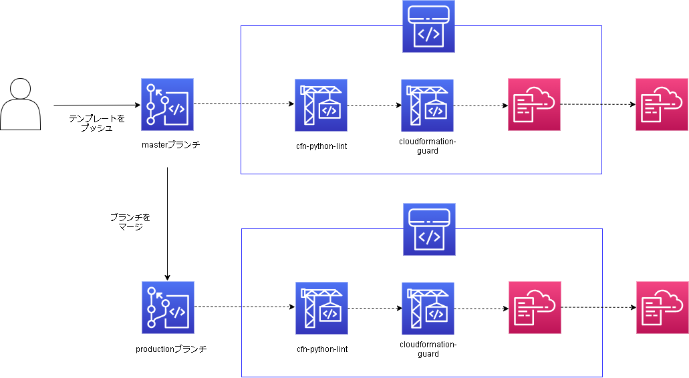

# 概要
本資料はAWS CloudFormationのスタック作成にCI/CDの仕組みを取り入れるための解説資料です。  
また、CI/CDパイプラインを構築するCloudFormationテンプレートも付属しています。  

パイプラインはAWS CodePipelineを使用します。AWS CodeCommitにプッシュされたCloudFormationテンプレートをテストし、パスしたテンプレートのみスタックが作成されるようになります。  

パイプライン中では22種類のテストを行います。記法・文法のチェックと、予め作成したポリシーを用いた設定値のチェックです。  

本資料で作成可能な構成は以下の図に示す通りです。  

# CI/CDフロー図

# 使用するテストツール
- [AWS CloudFormation Linter](https://github.com/aws-cloudformation/cfn-python-lint)
- [AWS CloudFormation Guard](https://github.com/aws-cloudformation/cloudformation-guard)

# ドキュメント
- [環境構築](./docs/deploy.md)

# その他
