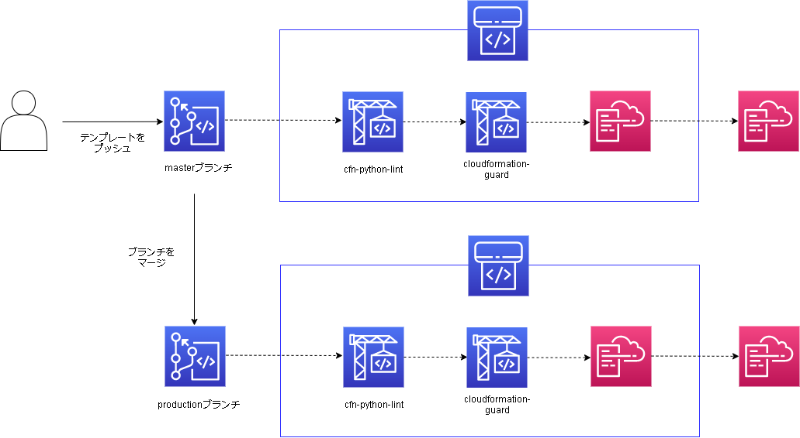

# 目次
- [目次](#目次)
- [環境構築](#環境構築)
  - [前提](#前提)
  - [1. パイプライン作成](#1-パイプライン作成)
  - [2. 必要資材を格納](#2-必要資材を格納)
  - [3. パイプライン確認](#3-パイプライン確認)
    - [master](#master)
    - [production](#production)
  - [4. パイプライン削除](#4-パイプライン削除)


# 環境構築
## 前提
- `iam:PassRole`ポリシーが適用されたIAMユーザを使用すること
- `aws`コマンドが使用できること（AWSコンソールを使用してCloudFormationスタックを作成する場合は不要です）


## 1. パイプライン作成
まずはこのリポジトリを任意のディレクトリにクローンします。  

```
export CLONEDIR=`pwd`
git clone https://github.com/cnc4e/cloudformation-cicd.git
```

以下図のCI/CDパイプラインを作成します。  

  

クローンしたディレクトリ内のテンプレートを使い、CloudFormationスタックを作成します。  
CodeCommitのリポジトリのmasterブランチをソースとするパイプラインと、CodeCommitリポジトリのproductionブランチをソースとするパイプラインの2種類が作成されます。  
作成する方法はAWS CLIまたはAWSコンソールどちらでも構いません。以下はコマンドでCloudFormationスタックを作成する場合の手順です。  

```
aws cloudformation create-stack --stack-name Cloudformation-cicd-master --template-body file://$CLONEDIR/cloudformation-cicd/cfn-template/pipeline-master.yml --capabilities CAPABILITY_NAMED_IAM

aws cloudformation create-stack --stack-name Cloudformation-cicd-production --template-body file://$CLONEDIR/cloudformation-cicd/cfn-template/pipeline-production.yml --capabilities CAPABILITY_NAMED_IAM
```
  

CI/CDパイプラインが作成されているか確認します。以下の手順はAWSコンソールを使用してください。    
- サービス > CloudFormation > スタック で`Cloudformation-cicd-master`及び`Cloudformation-cicd-production`スタックのステータスが`CREATE_COMPLETE`になっていることを確認
- サービス > CodePipeline > パイプライン で`Cloudformation-cicd-master`及び`Cloudformation-cicd-production`パイプラインが作成されていることを確認（この時点ではパイプライン内のSourceアクションは失敗していて構いません）
- サービス > CodeBuild > ビルドプロジェクト で以下のプロジェクトが作成されていることを確認
  - `Cfn-lint-master`
  - `Cfn-guard-master`
  - `Cfn-lint-production`
  - `Cfn-guard-production`
- サービス > CodeCommit > リポジトリ で`CloudFormationTemplate`リポジトリが作成されていることを確認
  

これでCI/CDパイプラインが作成されました。ただし今のままでは必要なファイルが存在していないため動作しません。次のステップでは必要なファイルをCodeCommitのリポジトリに格納します。  

## 2. 必要資材を格納
作成したCI/CDパイプラインを動作させるためには、以下のファイルをCodeCommitのリポジトリに格納する必要があります。  
- CodeBuildで使用するbuildspec（Cfn-lint用）
- CodeBuildで使用するbuildspec（CloudFormationGuard用）
- CloudFormationGuardで使用するポリシー
- 実際にデプロイしたいCloudFormationテンプレート  

buildspecはCodeBuildを動作させるのに必要なファイルです。Cfn-lintであればPython環境を作成しテストを実行していますし、CloudFormationGuardであればRust環境を作成しテストを実行しています。buildspecの内容を書き換えることによって環境や実行するテストを変更することが可能です。特にCfn-lintの方では`--ignore-checks W`というワーニングを回避するオプションを与えているため、どの程度厳しくテンプレートをチェックするかによってオプションを変更してください。  

CloudFormationGuardで使用するポリシーはテンプレートの値をチェックするのに使います。[ポリシーの記法](https://github.com/aws-cloudformation/cloudformation-guard/blob/master/cfn-guard/README.md#writing-rules)に則ってポリシーを書き換えることで、テンプレートの値がポリシーの範囲外だった場合にエラーを返します。`cfn-guard rulegen`コマンドによってテンプレートからポリシーを作成することも可能です。  


最初にクローンしたディレクトリ内に、それぞれのファイルのサンプルを用意しています。これらのファイルをコピーし、CodeCommitのリポジトリに格納します。  
まずディレクトリを移動します。  
```
cd $CLONEDIR
```

その後`接続のステップ`（サービス > CodeCommit > リポジトリ > `CloudFormationTemplate`）に書かれた手順を実行し、CodeCommitのリポジトリをクローンしてください。クローンしたディレクトリは空の状態です。  
後ほど本番環境で使用するため、今クローンしたディレクトリで`production`ブランチを作成しプッシュします。  
```
git checkout -b production
git push origin production
```

クローンしたディレクトリに必要資材をコピーします。  
```
cp $CLONEDIR/cloudformation-cicd/cfn-lint/* $CLONEDIR/CloudFormationTemplate/
cp $CLONEDIR/cloudformation-cicd/cloudformation-guard/* $CLONEDIR/CloudFormationTemplate/
```

CodeCommitのリポジトリに格納します。  
```
cd $CLONEDIR/CloudFormationTemplate
git add .
git commit -m "init"
git push
# プッシュ時のユーザ名/パスワードは、CodeCommitのリポジトリクローン時のものと同じです
```

CodeCommitのリポジトリに格納されているか確認します。以下の手順はAWSコンソールを使用してください。     
- サービス > CodeCommit > リポジトリ > `CloudFormationTemplate`リポジトリ で以下のファイルが存在していることを確認
  - `buildspec-cfn-lint.yml`
  - `buildspec-cfn-guard.yml`
  - `cfn_guard_ruleset_example`
  - `cfn_template_file_example.yaml`

必要資材を格納したため、これでCI/CDパイプラインが動作します。次のステップでは、記法チェックやポリシーチェックが行われ、CloudFormationテンプレートがデプロイされているかどうか確認します。

## 3. パイプライン確認
今回作成したパイプラインは以下の動作をします。
- CloudFormationテンプレートを含む必要資材をCodeCommitから取得
- Cfn-lintを使用した記法チェック
- CloudFormation-guardを使用したポリシーチェック
- チェックに合格したCloudFormationテンプレートをデプロイ

### master
AWSコンソールで、サービス > CodePipeline > パイプライン > `Cloudformation-cicd-master`パイプライン を表示します。すべての項目をパスし、CloudFormationテンプレートがデプロイされるまで5分～10分程度かかります。最後の`Release`アクションをパスしたら、以下を確認します。  
- テンプレート記載のリソースがデプロイされていること

### production
masterブランチをproductionブランチにマージすると、`Cloudformation-cicd-production`パイプラインが動作し始めます。つまり、マージ操作をすることで記法チェックやポリシーチェックを行った上で本番環境へのデプロイが行われます。  

AWSコンソールで、サービス > CodeCommit > リポジトリ > `CloudFormationTemplate` > プルリクエスト を表示します。`プルリクエストの作成`より、以下の内容でプルリクエストを作成します。  
- ターゲット：production
- ソース：master
- タイトル：テンプレート追加

プルリクエスト作成後の画面右上の`マージ`より、先ほど作成したプルリクエストをマージします。（早送りマージで構いません）  

AWSコンソールで、サービス > CodePipeline > パイプライン > `Cloudformation-cicd-production`パイプライン を表示します。すべての項目をパスし、CloudFormationテンプレートがデプロイされるまで5分～10分程度かかります。最後の`Release`アクションをパスしたら、以下を確認します。  
- テンプレート記載のリソースがデプロイされていること

## 4. パイプライン削除

削除する方法はAWS CLIまたはAWSコンソールどちらでも構いません。以下はコマンドでCloudFormationスタックを削除する場合の手順です。 
```
# パイプラインからデプロイされたスタックを削除
aws cloudformation delete-stack --stack-name CloudFormationCICD-master
aws cloudformation delete-stack --stack-name CloudFormationCICD-production
# パイプラインのスタックを削除
aws cloudformation delete-stack --stack-name Cloudformation-cicd-master
aws cloudformation delete-stack --stack-name Cloudformation-cicd-production
```

