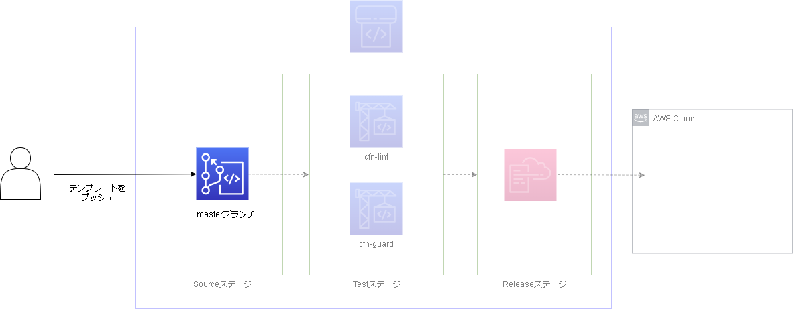
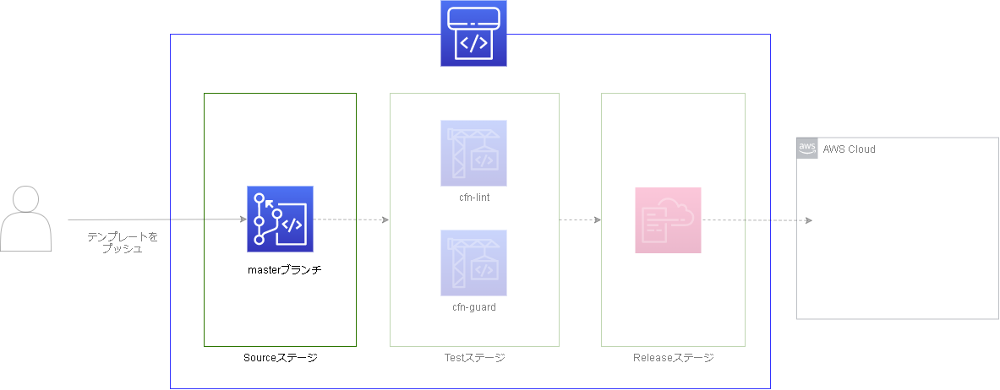
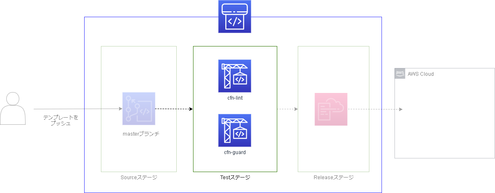
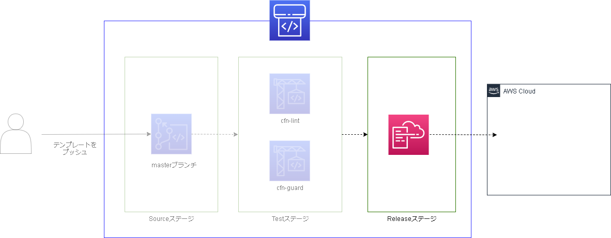

# 目次
- [目次](#目次)
- [作成されるリソース](#作成されるリソース)
- [CI/CDフローについて](#cicdフローについて)
  - [CodeCommitにソースをPush](#codecommitにソースをpush)
  - [CodePipelineがキックされる](#codepipelineがキックされる)
  - [CodeBuildでソースのテストを実施](#codebuildでソースのテストを実施)
  - [CloudFormationで環境にデプロイ](#cloudformationで環境にデプロイ)
- [ブランチ戦略について](#ブランチ戦略について)
  - [GitLab-flow](#gitlab-flow)
- [用語](#用語)
  - [CodePipeline](#codepipeline)
    - [ステージ](#ステージ)
    - [アクション](#アクション)
    - [アクションプロバイダ](#アクションプロバイダ)

# 作成されるリソース
今回のリファレンスでは、パイプラインと関連リソースをCloudFormationスタックで作成します。  
ブランチ問わず共通で使用するリソースは[pipeline-base.yml](../pipeline-template/pipeline-base.yml)で作成し、ブランチごとのリソースは[pipeline-template.yml](../pipeline-template/pipeline-template.yml)にパラメータを渡して作り分けます。  
以下は作成されるリソース一覧です。  

- 共通リソース  

  |リソース|説明|
  |-|-|
  |CodeCommit|環境にデプロイするCFnソースを配置するリポジトリ。パイプラインのトリガとなるソース置き場。サンプルでは`CloudFormationTemplate`という名前で作成する。|
  |IAMロール(CodeBuid用)|CodeBuild実行用ロール。サンプルでは`cfn-cicd-base-SERVICEROLEforCODEBUILD-<乱数>`という名前で作成する。|
  |IAMロール(CodePipeline用)|CodePipeline実行用ロール。サンプルでは`cfn-cicd-base-SERVICEROLEforCODEPIPELINE-<乱数>`という名前で作成する。|
  |IAMロール(CloudFormation用)|CloudFormation実行用ロール。サンプルでは`cfn-cicd-base-SERVICEROLEforCLOUDFORMATION-<乱数>`という名前で作成する。CodePipelineのReleaseアクションでCloudFormationを実行する際に使用する。|

- ブランチごとのリソース 

  |リソース|説明|
  |-|-|
  |S3バケット(CodeBuild用)|CodeBuildのキャッシュ用バケット。サンプルでは`cfn-cicd-<ブランチ名>-s3bucketforcodebuild-<乱数>`という名前で作成する。|
  |CodeBuild(cfnlint)|cfnlintを実行するCodeBuild。サンプルでは`Cfn-lint-<ブランチ名>`という名前で作成する。|
  |CodeBuild(cfnguard)|cfnguardを実行するCodeBuild。サンプルでは`Cfn-guard-<ブランチ名>`という名前で作成する。|
  |S3バケット(CodePipeline用)|CodePipeline用のバケット。ステージ間のデータ受け渡しに使用。サンプルでは`cfn-cicd-<ブランチ名>-s3bucketforcodepipeline-<乱数>`という名前で作成する。|
  |CodePipeline|CICDパイプライン。サンプルでは`cfn-cicd-<ブランチ名>`という名前で作成する。|

# CI/CDフローについて
作成するCI/CDパイプラインは主に以下のようなフローで構成されます。
- CodeCommitにソースをPush
- CodePipelineがキックされる
- CodeBuildでソースのテストを実施
  - Cfn-lintによる文法チェック
  - Cfn-guardによるポリシーチェック
- CloudFormationで環境にデプロイ

今回は[ブランチ戦略](#ブランチ戦略について)に基づき、`master`と`production`という2つのブランチ・2つの環境を想定したサンプルになっています。（`feature`は使用しません）CI/CDパイプラインが実際にどのようなフローであるか、図示します。なお、`production`環境はCodePipelineのトリガがマージであること以外は同じであるため、ここでは`master`環境として解説します。

## CodeCommitにソースをPush
  
CI/CDパイプラインが作成されている状態でソース一式をCodeCommitの対象ブランチにPushします。  
サンプルでは以下のソースを扱います。
- CodeBuildで使用するbuildspec（Cfn-lint用）
- CodeBuildで使用するbuildspec（Cfn-Guard用）
- Cfn-guardで使用するポリシー
- CloudFormationでデプロイするテンプレート

## CodePipelineがキックされる
  
そうするとCodeCommitへのPushをトリガに、CodePipelineがキックされます。  
CodePipelineの`Source`ステージに設定した`Source`アクションによって、CodeCommitのソースがCodePipelineに読み込まれます。ここで読み込まれたソースはCodePipelineの以降のステージでも扱います。  
なお、CodeCommitの対象ブランチにマージが行われた場合でもトリガになり得ます。

## CodeBuildでソースのテストを実施
  
**このフローはCI/CDにおけるCI（continuous integration）に相当します。**  
ソースが読み込まれると、CodePipelineの`Test`ステージに設定した2つのアクションが並行して動作し始めます。`Cfn-lint`と`Cfn-guard`の2種類で、これらはCodeBuildをアクションプロバイダとして動作します。  
`Cfn-lint`ではCloudFormationテンプレートの文法チェックを行い、`Cfn-guard`ではCloudFormationテンプレートに設定した値がポリシーに沿っているかチェックします。  
それぞれのチェックが成功すると次のステージに進みます。失敗した場合、パイプラインは途中で停止します。  

## CloudFormationで環境にデプロイ
  
**このフローはCI/CDにおけるCD（continuous deployment）に相当します。**  
ソースのテストが成功するとCodePipelineの`Release`ステージに移行します。  
ここではCloudFormationをアクションプロバイダとして、CloudFormationテンプレートを実際にデプロイします。  
環境はCodeCommitのブランチ名を元にしてAWS上に作成されます。そのため`master`ブランチにPushしたソースからは`master`と称した環境が作成されます。  
なお、今回のリファレンスでは自動でデプロイまで行うパイプラインを紹介しています。しかし、環境によっては自動デプロイの前に管理者による承認を得たい場合もあるかと思います。そのような場合、ソースに対するテストとデプロイの間に管理者によるapprove(承認)を要求するアクションを追加します。[参考](https://docs.aws.amazon.com/ja_jp/codepipeline/latest/userguide/approvals.html)  

以上のフローにより、CloudFormationテンプレートに対するCI/CDが行われます。  

# ブランチ戦略について
今回のリファレンスでは`GitLab-flow`を採用しています。なお、次の参考ページをまとめた内容です。[Introduction to GitLab Flow](https://docs.gitlab.com/ee/topics/gitlab_flow.html)  
ブランチ戦略は他にも`Git-flow`、`GitHub-flow`がありますが、ここでは割愛します。

## GitLab-flow
以下3種類のブランチを使い分ける戦略。通常の開発はmasterブランチをベースに行う。何らかの修正を加えた場合、masterブランチからfeatureブランチを作成し、修正が完了したらmasterにマージする。masterブランチで動作を確認したのち問題なければproductionブランチにマージします。(場合によってはproductionブランチの前にstagingブランチなどを設け、より本番に近い環境でテストしてからproductionブランチにマージしても良いです。)

- master
- production
- feature

この戦略は環境差異を含むレポジトリの管理に有効な戦略です。

  
# 用語
## CodePipeline
### ステージ
1つまたは複数の[アクション](#アクション)をまとめたものです。  

### アクション
パイプライン中で実行されるタスクを定義したものです。  
ソース、ビルド、テスト、デプロイ、承認、呼び出しという6つのアクションタイプが存在し、アクションのカスタムができる他、それぞれに[アクションプロバイダ](#アクションプロバイダ)を統合できます。

### アクションプロバイダ
アクションに統合できるAWSサービス、またはパートナーサービスを指します。  
例えばソースアクションに`CodeCommit`や`GitHub`などを統合することができますし、デプロイアクションに`CodeDeploy`や`CloudFormation`などを統合することができます。統合されたアクションにパラメータを与えるだけで、パイプライン-サービス間の連携を簡単に取ることができます。